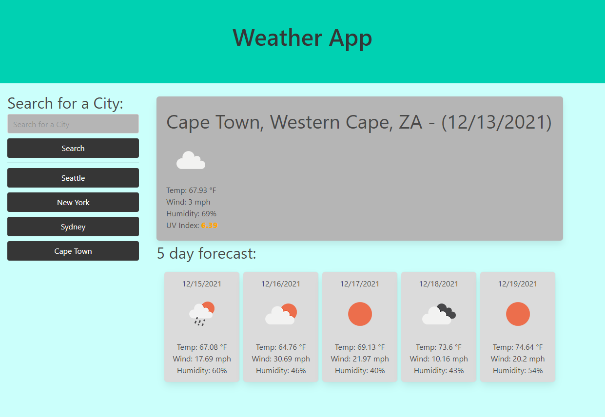

# Weather Dashboard

## Contributor - Chris Kimball

### Description
---------------

The following project is a web application that allows the user to lookup weather forecast for a city to see current weather conditions as well as a five day forecast. Weather data is provided to the application by the OpenweatherMap serverside API's (Geocoding API and One Call API).

Upon initial page load the user will presented with a search form to lookup a city name, when the user searches for a city a button will be added for the city name that was searched.

When the user searches for a city they will be returned the following 'current' data:

* City, State and Country of the weather data
* Current date
* Icon of the current weather conditions (sunny, cloudy, windy, clear, etc.)
* Current temperature (in Fahrenheit)
* Current Windspeed (in miles per hour)
* Current Humidty
* Current UV Index

The color of the UV Index will indicate to the user whether the current UV Index is favorable, moderate, or severe. UV Indexes less than 2 will be green (favorable), UV Indexes between 2 and 5 will be yellow (moderate), UV index between 5 and 8 will be orange (moderately-high), UV Index between 8 and 10 will be red (severe) and if the UV index is higher than 10 it will be purple (very severe).

In addition to current weather conditions the user will be presented with a five day forecast for the city they searched. The five day forecast will include the following data:

* Date of forecast
* Icon of the forcasted weather conditions (sunny, cloudy, windy, clear, etc.)
* Forecasted temperature (in Fahrenheit)
* Forecasted Windspeed (in miles per hour)
* Forecasted Humidity

The favicon for the site will be replaced with the current weather icon for the data that was returned.

### Technologies used
---------------

The functionality behind this website would not be possible without the following technologies:
* [OpenweatherMap One Call API](https://openweathermap.org/api/one-call-api "One Call API")
* [OpenweatherMap Geocoding API](https://openweathermap.org/api/geocoding-api "Geocoding API")
* [Bulma HTML and CSS framework](https://getbootstrap.com/ "Bootstrap homepage")
* [jQuery Library](https://jquery.com/ "jQuery homepage")
* [Moment.js](https://momentjs.com/ "Moment.js homepage")
* Javascript
* HTML / CSS

### Web addresses
---------------

*  [Deployed Website](https://chriskimball.github.io/weather-dashboard-18372/ "Weather Dashboard")

*  [Github Repository](https://github.com/chriskimball/weather-dashboard-18372 "Github Repo")

### Installation
---------------

1. Clone this Git repository
2. Navigate to repository in local directory.
3. Open index.html on default web browser.

### Screenshots
---------------

